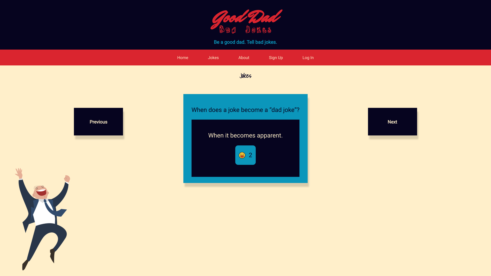
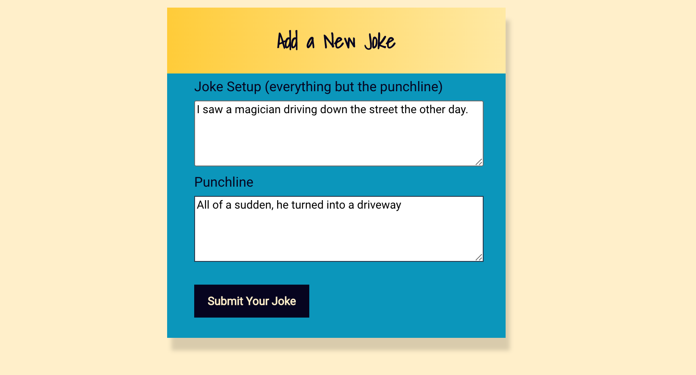

## Date: 12/23/2021
### By: Benjamin Peck
#### [GitHub](https://github.com/benjaminobambino) | [LinkedIn](https://www.linkedin.com/in/benjaminlpeck/) | [Website](https://benjaminlpeck.vercel.app/)
***
### ***Description***
#### "Good Dad Bad Jokes" is a browser-based, full-stack MERN (MongoDB, Express, React, and Node) app that does exactly what a good dad should: tell bad jokes. Upon launch, users can immediately enjoy jokes being pulled from the back-end database. Users who sign up can "like" their favorite jokes and contribute their own jokes to the database.
#### Jokes and user info are stored in the back-end database and updated by the front-end user interface through axios calls.
***
### ***Technologies Used***
* MongoDB
* Node
* Mongoose
* Express
* React
* JavaScript
* CSS
  * Flexbox
* HTML
* JWT Auth
***
### ***Getting Started***
#### A Trello board was used to keep track of development progress. It can be viewed [here](https://trello.com/b/VXInuKS4/good-dad-bad-jokes).
#### The project has been deployed and able to be viewed at [GoodDadBadJokes.Vercel.app](https://gooddadbadjokes.vercel.app/).
#### Once launched, create a user account to add your own jokes, like jokes, and flag jokes. Otherwise, just open the app and enjoy the jokes!
***
### ***Screenshots***
#### Landing Page

#### Jokes

#### Submit New Jokes

***
### ***Future Updates***
- [x] Add JWT Auth
- [x] Add user's liked jokes component
- [ ] Mobile-friendly design
- [ ] Add joke flagging functionality
- [ ] Add functionality to minimize or eliminate repeated jokes
- [ ] Add user's contributed jokes component
- [ ] Add joke search feature
- [ ] Add joke categories
***
### ***Credits***

##### Happy Dad Image: [Pinclipart.com](https://www.pinclipart.com/)

##### Laugh Icon: [tulpahn](https://www.flaticon.com/authors/tulpahn) from [www.flaticon.com](https://www.flaticon.com/)

##### Sad Icon: [Freepik](https://www.freepik.com) from [www.flaticon.com](https://www.flaticon.com/)

##### Jokes: Everyone who has ever told me a joke